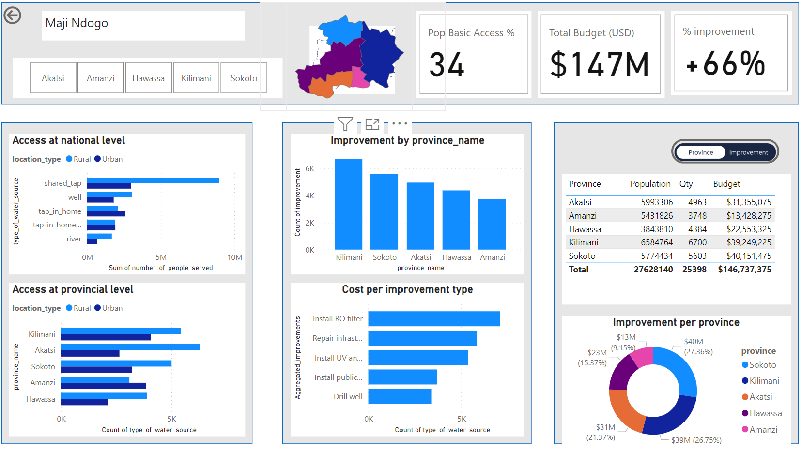
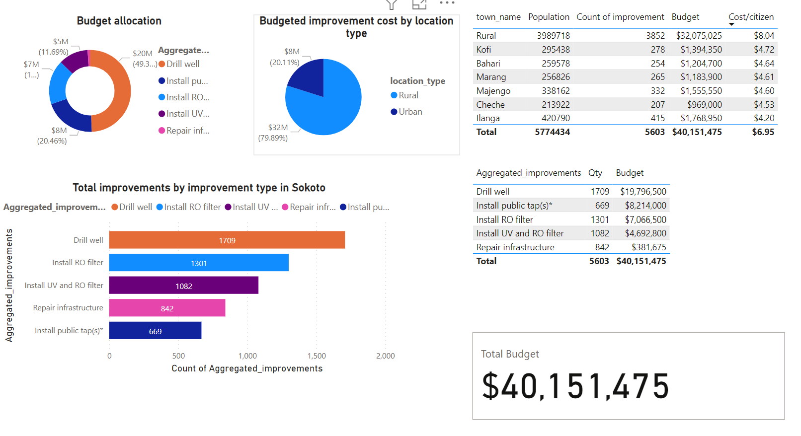
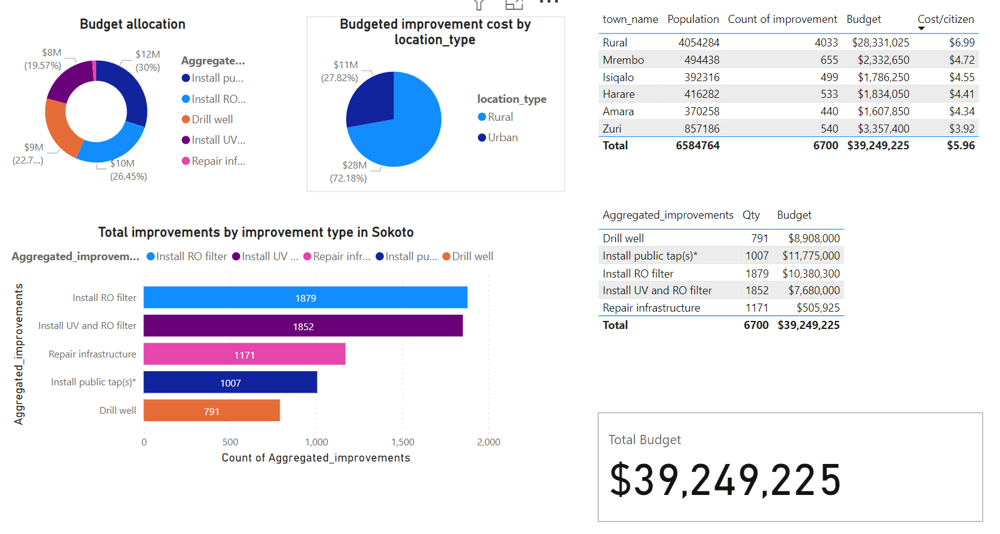
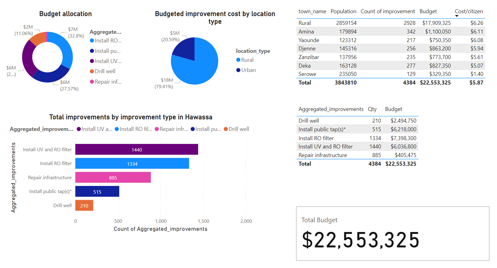
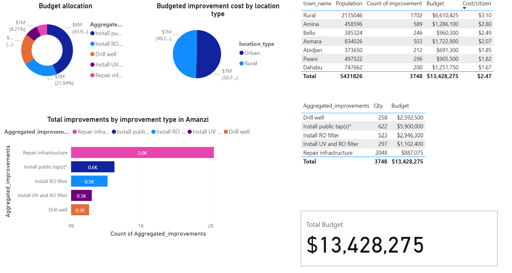
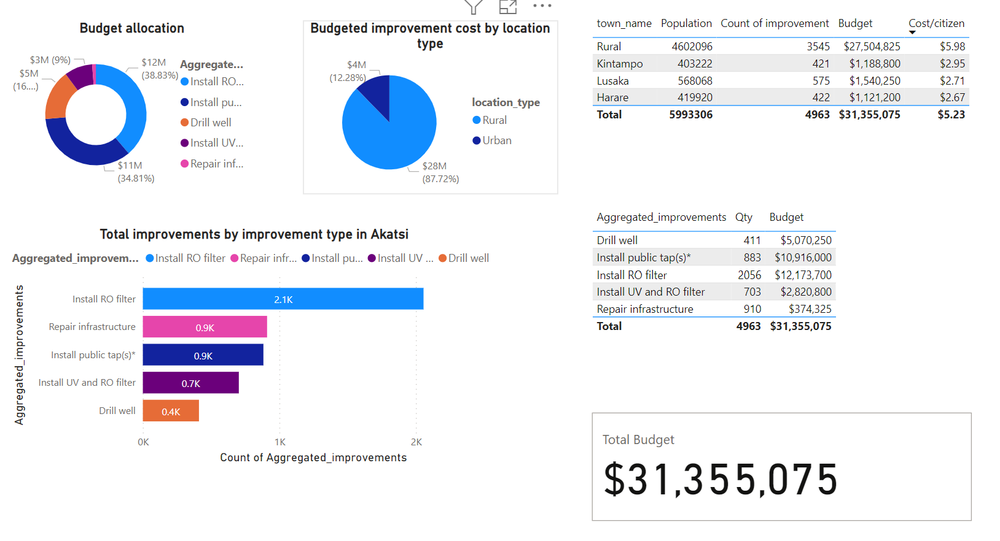

# Crafting Visual Narratives with Data: The Maji Ndogo Power BI Journey
**Overview:**
Imagine a world where water scarcity is a thing of the past. This Power BI project brings that vision to life for Maji Ndogo. By visualizing water sources, crime rates, and infrastructure development, we've uncovered critical trends and identified areas for improvement.

Our interactive dashboards empower stakeholders to make data-driven decisions and work towards a more sustainable and prosperous Maji Ndogo.

## 1. Water Infrastructure Analysis:
### Understanding the Water Landscape
Maji Ndogo's water infrastructure is a complex system that directly impacts the lives of its citizens. To gain a deeper understanding, we analyzed the distribution of water sources, population dynamics, and the impact of these sources on different communities.
**Geographical Context:** A map provides a visual representation of provinces—Sokoto, Hawassa, Kilimani, Amanzi, Akatsi.

**Population Dynamics:** A pie chart outlines the population distribution between Rural and Urban areas.

**Water Source Impact:** Treemap analysis displays the number of people served by each water source.

**Source Distribution:** Bar chart illustrates the prevalence of well, tap in home, tap in home broken, shared tap, and river as water sources.

**Town-specific Details:** Stacked bar chart delves into water sources in each town.

## 2. Crime Data Exploration:
### Unveiling Patterns of Crime
Understanding the nature and prevalence of crime is essential for creating a safe and secure environment in Maji Ndogo. Our analysis of crime data reveals key trends and patterns that can inform targeted interventions.
**Crime Types:** Pie chart visualizes the distribution of crime types—harassment, theft, sexual assault, public intoxication, severe assault, vandalism, and murder—based on victim gender.

**Regional Demographics:** Clustered bar chart displays victim gender distribution for each crime type across provinces.

**Temporal Trends:** Line charts highlight crime occurrences by hour of day and day of the week, considering victim gender.

## 3. Improvement Project Budget Breakdown:
### Prioritizing Investments
To ensure that resources are allocated effectively, we analyzed the budget breakdown for various improvement projects. This analysis provides valuable insights into the priorities and challenges of development in Maji Ndogo.
**Improvement Types:** Doughnut chart illustrates budget allocation based on improvement types

**Location-based Costs:** Pie chart showcases budgeted improvement costs categorized by location types (Rural and Urban).

**Scope of Projects:** Bar chart breaks down the total number of improvements required in Maji Ndogo

**Town-level Details:** Detailed table provides budget breakdown per town, including population, number of improvements, and cost per citizen.

## 4. Additional Tables for In-depth Analysis:
### Gaining Deeper Insights
To provide a more comprehensive understanding of the improvement projects, we've created two additional tables:
**Aggregated Improvements:** A table aggregates improvements by type, providing a consolidated view of projects

**Total Budget for Provinces:** A summary displays the total budget allocated for all improvement projects in each province. 

## Maji Ndogo Water Infrastructure

## Unlocking Water Security in Maji Ndogo: A Deep Dive with Power BI
This section delves into the water infrastructure analysis within our Power BI report, highlighting critical aspects impacting Maji Ndogo's water security.
**1.Setting the Stage: Geographical Context** The journey begins with a map of Maji Ndogo, showcasing its diverse provinces: Sokoto, Hawassa, Kilimani, Amanzi, and Akatsi. This visual provides a crucial geographical context, helping us understand the spatial distribution of the population and water resources.

**2. Population Distribution: Urban vs. Rural** Following the map, a pie chart reveals the population breakdown between rural and urban areas. This insight is vital for planning water infrastructure projects, as rural communities often face unique challenges in accessing clean water.

**3. Treemap: Unveiling the Reach of Water Sources** Next, a treemap visualization dives deeper, showcasing the number of people served by each water source across different provinces. This powerful tool allows us to compare the reach and impact of various water sources, revealing areas where service coverage is limited.

**4. Water Source Distribution: A Clear Picture** A bar chart paints a clear picture of the prevalence of each water source type - well, tap in home (functional and broken), shared tap, and river. This visual helps us understand the current state of water infrastructure in Maji Ndogo, highlighting which sources are most widely used and which areas may require urgent intervention.

 **5. Town-level Breakdown: Tailoring Solutions** Finally, a stacked bar chart provides a granular view of water sources within each town. This detailed breakdown is invaluable for identifying areas with limited access to clean water and directing resources towards targeted improvements.

By analyzing these diverse visualizations, we gain a comprehensive understanding of Maji Ndogo's water infrastructure landscape. The insights gleaned from this data empower us to identify challenges, prioritize improvements, and ultimately work towards ensuring water security for all citizens.

 ## Queues

 

 ## Unveiling the Wait: Insights into Queues in Maji Ndogo with Power BI
 This section explores the queues in Maji Ndogo, analyzed through the Power BI dashboard. Understanding queue patterns and trends is crucial for improving service delivery and streamlining processes.
**1. Hourly Trends: Optimizing Resources** The dashboard starts with a line chart depicting average queue times throughout the day. This dynamic visualization helps identify peak waiting hours, enabling authorities to optimize resource allocation and potentially adjust staffing levels.

**2. Weekly Variations: Strategic Planning** Following the line chart, a bar graph analyzes average queue times across different days of the week. This macro-level view unveils potential weekly trends, informing strategic planning and scheduling to minimize wait times for citizens.

**3. Gender Breakdown: Ensuring Inclusivity** A doughnut chart dives deeper, presenting the composition of queues based on gender across Maji Ndogo's provinces. This visual exposes potential gender disparities in queue times, allowing for targeted interventions to promote inclusivity and address any identified gender biases.

**4. Province-Specific Analysis: Localized Solutions** The final visualization, a bar chart, provides a detailed breakdown of queue times in each province. This granular analysis empowers stakeholders to identify areas experiencing the most significant wait times, facilitating localized improvements and efficient resource allocation.

By analyzing these diverse visualizations, we gain a comprehensive understanding of queue patterns in Maji Ndogo. This data-driven approach can lead to significant improvements in service delivery, ultimately reducing waiting times and enhancing the overall experience for citizens.

## Water Quality 

**Is the Water Safe? Unveiling Water Quality in Maji Ndogo with Power BI** This section explores water quality in Maji Ndogo, analyzed through the Power BI dashboard. Access to clean water is fundamental for public health and well-being. However, this dashboard helps shed light on the current situation by analyzing water quality parameters.

## Pie Chart Composition:
**1. A Snapshot of Water Quality:** The journey begins with a critical visualization - a pie chart showcasing the distribution of clean vs. polluted water sources across Maji Ndogo. This clear snapshot allows us to gauge the overall state of water quality in the region, highlighting areas where clean water might be scarce.

**2. Delving Deeper: Types of Contamination:** 
Understanding the specific types of contamination is crucial. To address this, we further analyze the pie chart composition:

Clean Water: This segment represents the percentage of water sources categorized as safe for drinking and household use.
Contaminated (Biological): This portion highlights the proportion of water sources contaminated by biological agents like bacteria, posing potential health risks like waterborne diseases.
Contaminated (Chemical): This segment indicates the percentage of water sources contaminated by chemical pollutants, raising concerns about long-term health effects and potential water treatment needs.
By analyzing this data, we gain valuable insights into the water quality landscape in Maji Ndogo. Identifying areas with high levels of contamination empowers stakeholders to prioritize water treatment efforts and implement targeted interventions to ensure safe drinking water for all citizens.

## Crime data in Maji Ndogo

**Safeguarding Maji Ndogo: Unveiling Crime Patterns with Power BI**
Understanding crime patterns is crucial for creating a safe and secure environment. This section delves into the crime data analysis from the Power BI dashboard, providing valuable insights to inform targeted interventions.

**1. A Look at Crime Types:** The analysis begins with a pie chart showcasing the distribution of crime types across Maji Ndogo, categorized by victim gender. This visualization reveals the prevalence of different crimes and potential gender disparities.

**2. Regional Variations: Where and Who?**
To understand regional variations, a clustered bar chart depicts the victim gender distribution for each crime type across different provinces. This allows us to identify areas with higher crime rates and potential gender-specific trends.

**3. When and How: Unearthing Temporal Patterns**
Two line charts delve deeper into temporal trends. The first visualizes the occurrence of each crime type throughout the day, segmented by victim gender. This helps identify peak hours for specific crimes and potential gender-specific patterns.  The second line chart provides a weekly breakdown, illustrating crime occurrences by day of the week and victim gender. This can reveal patterns related to specific days or weekends and inform targeted law enforcement strategies.

By analyzing this data, we gain valuable insights into crime patterns in Maji Ndogo.  Understanding these trends can empower stakeholders to improve public safety measures, allocate resources effectively, and create a safer environment for everyone.

# **Maji Ndogo National Water Infrastructure Report**

## **Power BI Dashboard Summary: Transforming Data into Actionable Insights**

The Maji Ndogo Water Infrastructure Power BI report uncovers the region’s key water challenges and opportunities through visually engaging and data-driven storytelling. Here's what the dashboard reveals:

### **1. Geographical Overview**
A comprehensive map highlights Maji Ndogo's provinces—**Sokoto**, **Hawassa**, **Kilimani**, **Amanzi**, and **Akatsi**—providing geographical context for water infrastructure planning. This sets the stage for a deeper dive into each region's water supply realities.

### **2. Population Distribution**
A vibrant pie chart illustrates the population split between **Rural** and **Urban** areas. This demographic snapshot helps target water infrastructure efforts where they’re needed most.

### **3. Water Source Impact: Treemap Analysis**
The treemap breaks down the number of people served by each water source across provinces, helping visualize service coverage and identify disparities in water access.

### **4. Water Source Distribution**
A bar chart compares the distribution of water sources—**wells**, **in-home taps**, **broken taps**, **shared taps**, and **rivers**. This snapshot informs future strategies for improving water accessibility and infrastructure across Maji Ndogo.

### **5. Town-Level Water Source Breakdown**
Delve deeper into the specifics with a stacked bar chart showcasing each town’s water infrastructure. This granular view aids in tailoring interventions to meet localized needs.

---

## **Budget Breakdown for Improvement Projects Across Maji Ndogo**

The dashboard provides a detailed financial overview of planned water infrastructure improvements by province, offering transparency and clarity for decision-makers.

### **1. Budget Allocation by Improvement Type (Doughnut Chart)**
This chart visually represents how funds are allocated across various improvement categories, ensuring strategic resource distribution.

### **2. Budgeted Improvement Costs by Location Type (Pie Chart)**
A pie chart illustrates the financial commitment to improvements in **Rural** and **Urban** areas, guiding equitable resource allocation.

### **3. Total Improvements Required (Bar Chart)**
The bar chart quantifies the scope of infrastructure improvements across Maji Ndogo, giving stakeholders a clear view of the work ahead.

### **4. Budget Breakdown by Town (Table)**
A detailed table breaks down the budget per town, outlining the population served, improvements needed, and cost per citizen. This granular insight is key for localized decision-making.

---

## **Visual Snapshots of Maji Ndogo’s Provinces**

### **Sokoto**

### **Kilimani**

### **Hawassa**

### **Amanzi**

### **Akatsi**

---

## **Key Takeaways from the Maji Ndogo Dashboard**

### **1. Water Infrastructure Insights**
- **Spatial Understanding:** The map facilitates spatial planning, showing how each province is positioned for targeted infrastructure projects.
- **Demographic Considerations:** The population distribution highlights the need for solutions tailored to **Rural** and **Urban** demographics.
- **Water Source Impact:** Through treemaps and bar charts, the dashboard underscores the importance of various water sources and their distribution.

### **2. Crime Dynamics Analysis**
- **Crime Type Distribution:** A pie chart reveals crime patterns across genders, offering insights into key social challenges.
- **Regional Crime Demographics:** The bar chart adds a layer of depth by comparing crime statistics across provinces.
- **Temporal Trends:** Line charts illustrate crime patterns over time, helping law enforcement develop proactive strategies.

### **3. Improvement Project Planning**
- **Strategic Budget Allocation:** The doughnut and pie charts ensure funds are strategically distributed across different areas.
- **Scope of Improvements:** A clear view of the total infrastructure improvements required keeps stakeholders informed of project scope.
- **Localized Decision-Making:** Town-level data empowers decision-makers to make specific, impactful choices at the local level.

### **4. Data-Driven Governance and Community Empowerment**
- **Informed Decision-Making:** The dashboard offers data-driven insights, enabling authorities to plan and execute targeted interventions.
- **Transparent Governance:** By providing visibility into infrastructure and budget data, the dashboard fosters community trust and accountability.

---

## **Conclusion: A Dynamic Tool for Continuous Improvement**

The **Maji Ndogo Power BI Dashboard** is more than a report—it’s a powerful tool for informed decision-making, community empowerment, and ongoing enhancement of water infrastructure. With this data, stakeholders can act confidently, driving Maji Ndogo toward a future of equitable access and sustainable development.
